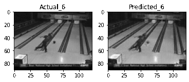
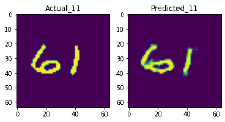
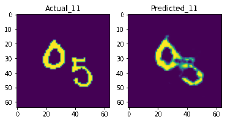

# Video Prediction using Transformers
## Will be updated soon...

## UCF101 Dataset
### Basketball Action Data
#### Convolutional Encoder-Decoder Networks
Two different Convolutional Encoder-Decoder Networks were trained over 600 10-length 
(5 input + 5 output) sequences of
basketball videos. These are later tested on 214 test sequences. The average mean squared loss for
the 2 layers model with 256 hidden units in each layer was 0.0124 while for the 3 layers model
with 160 hidden units in each layer was 0.0123.

  
  
   
  <emp> (a) 2 layers model </emp>
  &nbsp;&nbsp;&nbsp;&nbsp;&nbsp;&nbsp;&nbsp;&nbsp;&nbsp;&nbsp;&nbsp;&nbsp;&nbsp;&nbsp;&nbsp;
  &nbsp;&nbsp;&nbsp;&nbsp;&nbsp;&nbsp;&nbsp;&nbsp;&nbsp;&nbsp;&nbsp;&nbsp;&nbsp;&nbsp;&nbsp;
  <emp> (b) 3 layers model </emp>

  
  
   
  <emp> (a) 2 layers model </emp>
  &nbsp;&nbsp;&nbsp;&nbsp;&nbsp;&nbsp;&nbsp;&nbsp;&nbsp;&nbsp;&nbsp;&nbsp;&nbsp;&nbsp;&nbsp;
  &nbsp;&nbsp;&nbsp;&nbsp;&nbsp;&nbsp;&nbsp;&nbsp;&nbsp;&nbsp;&nbsp;&nbsp;&nbsp;&nbsp;&nbsp;
  <emp> (b) 3 layers model </emp>
 

 
#### Transformer Encoder-Decoder Networks
Will be added soon.

### Bowling Action Data
#### Convolutional Encoder-Decoder Networks
A 3 layers Convolutional Encoder-Decoder Networks was trained over 1200 10-length (5 input + 5 output) sequences of basketball videos. It was later tested on 430 test sequences. The average mean squared loss for the 3 layers model with 256, 128 and 128 hidden units in the 1st, 2nd and 3rd layers respectively was 0.0081.

  
  

 
#### Transformer Encoder-Decoder Networks
Will be added soon.

## Moving MNIST Dataset
### Transformer Encoder-Decoder Networks
A 5 layers Transformers Encoder Decoder Network with d-model = 64 and number of heads = 16 was trained over 1000 MNIST image sequences. The feed forward networks inside each encoder or decoder layer, constituted of 2 layers of convolutional neural networks. The model was tested on a test dataset of 300 image sequences and the average binary crossentropy loss was 0.5380.

  
  
  
 

