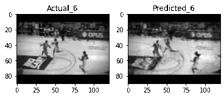

# Video Predictions using Transformer

## Background

Recurrent Neural Networks (RNNs) are well suitable for classifying, processing and making
predictions based on time series data. In theory, RNNs can learn long-term dependencies in
sequence-to-sequence problems (eg., Natural Language Processing) but in practice it doesn’t
seem to be able to learn. Later, LSTM Networks were introduced which is a special kind
of RNNs capable to learn long-term dependencies much better than RNNs. Though LSTM
Networks work well in practice, it requires the data to be processed in sequential order which
gives no scope for parallelization to reduce the training time.

The Transformer is a deep learning model that utilizes the mechanism of attention [[3]](#3). In
the context of neural networks, attention is a technique that mimics cognitive attention.
Cognitive attention [[1]](#1) is the behavioral and cognitive process of concentrating on a certain
aspect of information while ignoring other percievable information. The attention mechanism
in neural networks, enhances the relevant and important parts of the input and fades out the
unrelevant parts. The attention mechanism learns which parts are important through training.

The advantage of Transformers over the Recurrent Neural Networks is that it doesn’t require
the sequential data to be processed in order. This feature gives more scope for parallelization
during training than RNNs and therefore reduces the training time. There are networks where
attentions are used along with LSTMs but in practice it is found that attention mechanisms is
sufficient alone.

## Transformer for Video Predictions

<b> Video predictions </b> also comes under the sequence-to-sequence problems where the input 
is a sequence of continuous image frames and the expected outcome is also a sequence of image 
frames or video for some short duration. There are some models used for video predictions and 
most of them uses LSTM based models i.e., ConvLSTM. The model works well but as noted
earlier, it consumes a lot of memory and time during training. The memory consumption was
due to weights in the ConvLSTMs and the sequential nature of the input didn’t allow much
parallelization to reduce the training time. Here, we are trying to use the transformer which
have rapidly become a popular model of choice for sequence-to-sequence problems such as NLP.

The original transformer model described in the paper [[2]](#2) can be used mainly for tasks 
related to language processing. To make it work for image sequences or video, I have modified
the transformer model using the analogy between LSTM and ConvLSTM like converting dense neural
networks to convolutional neural networks, changing the input vector dimensions, etc. All these
changes have been described in the `btp_report.pdf` paper.

## Testing on an Artifical Dataset

The Keras next-frame prediction tutorial [[5]](#5) uses a very simple artifically generated dataset
for testing the video prediction model. One sample of the dataset is a sequence of image
frames. Each frame is 40 × 40 in size and has 3 - 7 squares moving inside the frame with
a constant velocity. The squares are of shapes 1 × 1 or 2 × 2 and have intensity value as 1
while background has 0 intensity value. Since it’s a very simple dataset, it helps to understand
whether the model can work on a simplest dataset.

A training dataset of 1000 image sequences was created with each sequence having 20
frames (10 input frames + 10 output frames). A 3 layer Encoder-Decoder Transformer model
was trained for 50 iterations to minimze average binary crossentropy loss using back- progation
through time and RMSProp optimizer(learning rate = 0.001 and decay rate = 0.9) was used.
In the model, d model = 64 and number of heads was set to 16. In the feed forward network
inside each encoder or decoder layer, 2 layers of convolutional neural network was used. First
CNN layer had 128 filters and the number of filters in the second layer was d model (= 64). The
filters size was 3 × 3 in every CNN layer. The final layer was also a CNN layer with 1 filter
and sigmoid activation. The total training loss was 0.0002.

  
  
  
 

 
## Moving MNIST Dataset

For training the transformer model, a dataset of 1000 MNIST image sequences was used. A
5 layer Encoder-Decoder Transformer model was trained for 50 iterations to minimze average
binary crossentropy loss using back- progation through time and RMSProp optimizer(learning
11rate = 0.001 and decay rate = 0.9) was used. In the network, d model = 64 and number of heads
was set to 16. The feed forward networks inside each encoder or decoder layer, constituted
of 3 layers of convolutional neural networks. First and the second CNN layer had 128 filters 
while the number of filters in the third layer was d model (= 64). The filters size was 3 × 3 in every CNN layer. The final layer was also a CNN layer with 1 filter and sigmoid activation. The model was tested on a test dataset of 300 image sequences and the average binary crossentropy loss
was 0.5380.

  
  
 

## UCF101 Dataset
### Basketball Action Data
#### Convolutional Encoder-Decoder Networks
Two different Convolutional Encoder-Decoder Networks were trained over 600 10-length 
(5 input + 5 output) sequences of
basketball videos. These are later tested on 214 test sequences. The average mean squared loss for
the 2 layers model with 256 hidden units in each layer was 0.0124 while for the 3 layers model
with 160 hidden units in each layer was 0.0123.

  
  
   
  <emp> (a) 2 layers model </emp>
  &nbsp;&nbsp;&nbsp;&nbsp;&nbsp;&nbsp;&nbsp;&nbsp;&nbsp;&nbsp;&nbsp;&nbsp;&nbsp;&nbsp;&nbsp;
  &nbsp;&nbsp;&nbsp;&nbsp;&nbsp;&nbsp;&nbsp;&nbsp;&nbsp;&nbsp;&nbsp;&nbsp;&nbsp;&nbsp;&nbsp;
  <emp> (b) 3 layers model </emp>

  
  
   
  <emp> (a) 2 layers model </emp>
  &nbsp;&nbsp;&nbsp;&nbsp;&nbsp;&nbsp;&nbsp;&nbsp;&nbsp;&nbsp;&nbsp;&nbsp;&nbsp;&nbsp;&nbsp;
  &nbsp;&nbsp;&nbsp;&nbsp;&nbsp;&nbsp;&nbsp;&nbsp;&nbsp;&nbsp;&nbsp;&nbsp;&nbsp;&nbsp;&nbsp;
  <emp> (b) 3 layers model </emp>
 

 
#### Transformer Encoder-Decoder Networks
Will be added soon.

### Bowling Action Data
#### Convolutional Encoder-Decoder Networks
A 3 layers Convolutional Encoder-Decoder Networks was trained over 1200 10-length (5 input + 5 output) sequences of basketball videos. It was later tested on 430 test sequences. The average mean squared loss for the 3 layers model with 256, 128 and 128 hidden units in the 1st, 2nd and 3rd layers respectively was 0.0081.

  
  

 
#### Transformer Encoder-Decoder Networks
Will be added soon.

## References
<a id='1'>[1]</a> (https://en.wikipedia.org/wiki/Attention)  
<a id='2'>[2]</a> (https://papers.nips.cc/paper/2017/file/3f5ee243547dee91fbd053c1c4a845aa-Paper.pdf)  
<a id='3'>[3]</a> (https://en.wikipedia.org/wiki/Transformer_(machine_learning_model))  
<a id='4'>[4]</a> (https://www.tensorflow.org/text/tutorials/transformer)  
<a id='5'>[5]</a> (https://keras.io/examples/vision/conv_lstm/)  
